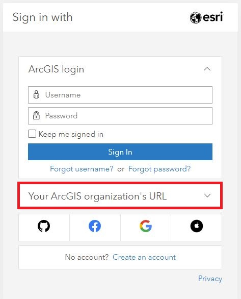
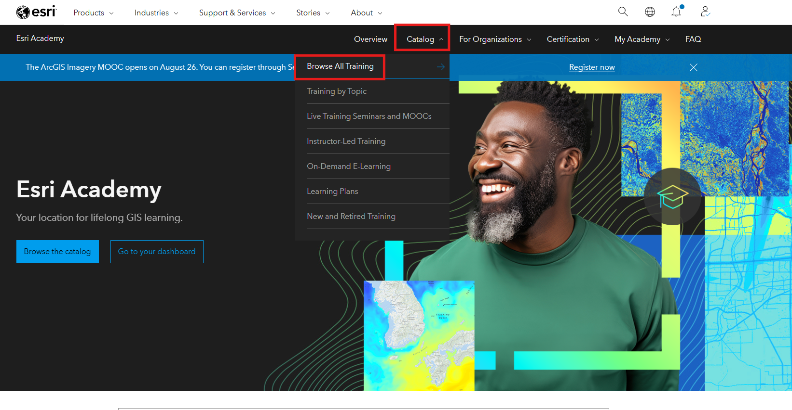
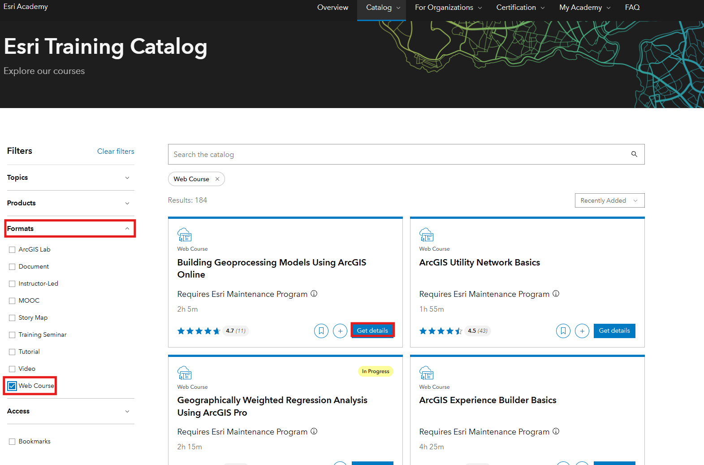
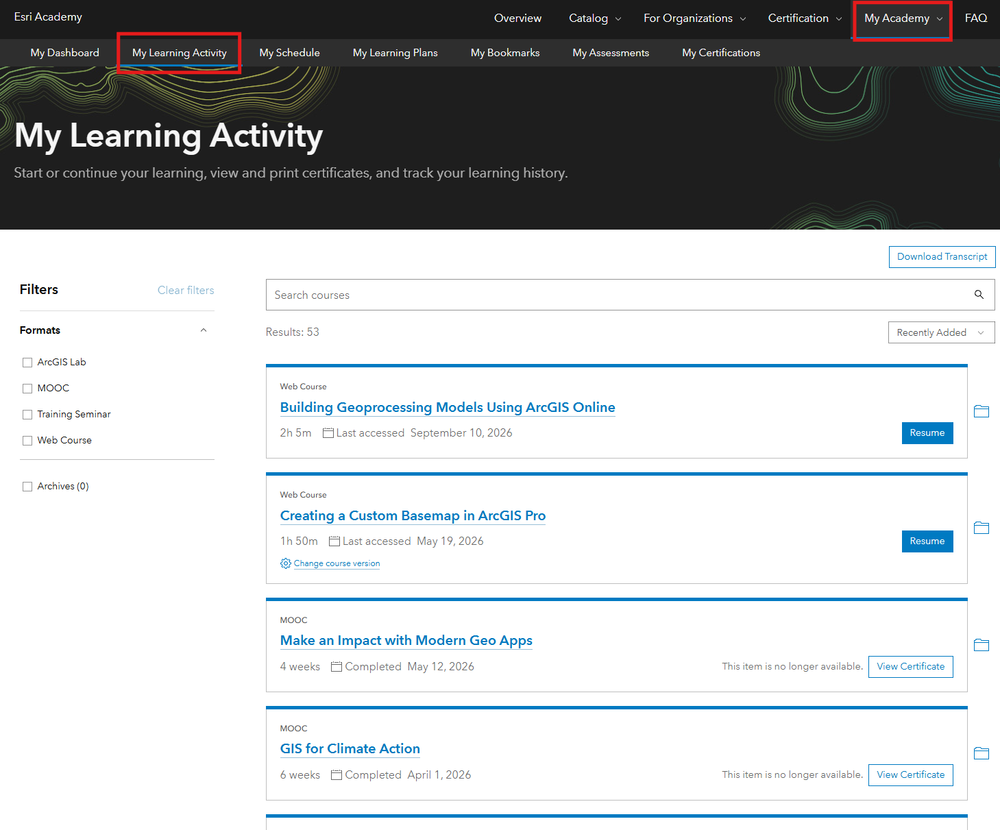

# How to Access Online GIS Classes in Esri Academy 

​University of Toronto community members can access online GIS courses through Esri Academy. Content is designed for beginners and experienced users.

 1. Log in to the University of Toronto's ArcGIS Online instance: <https://utoronto.maps.arcgis.com/>

    

2. More information on logging in can be found here: <https://mdlutoronto.github.io/arcgis-online-log-in/>

3. Navigate to the course directory:   
    (1\) Use this link: [https://www.Esri.com/training](https://www.Esri.com/training/). Log in with your UTORid, specifying 'utoronto' as the organization url.  
    (2\) Click "Catalog" at the top of the page then select "Browse All Training" to get to the course listings.

    

4. Once you have arrived at the course page you will find a number of filtering options. 

5. Note the other filtering options available: by topic, product and format. The Web Course format provides the most robust learning environment with courses that run 1 - 4 hours and include data to work with as well as learning activities to check your progress.

6. You can select a course by clicking "Get details" button and you can start the course by launching or registering to the the course. Alteratively, you can click the plus sign to add it to your Learning Plan or the ribbon icon to bookmark it for later.

6. Once you select a course it will be added to your profile. The My Learning Activity section of your account will keep track of your enrollments, as well as your progress.

7. If you are a GIS beginner, try the modules linked below.

    * "GIS Basics" for **ArcGIS Pro** users: [https://www\-Esri\-com.myaccess.library.utoronto.ca/training/catalog/5d9cd7de5edc347a71611ccc/gis\-basics/](https://www-Esri-com.myaccess.library.utoronto.ca/training/catalog/5d9cd7de5edc347a71611ccc/gis-basics/)

8. Also note that Esri has introduced a new learning portal, separate from Esri Academy, called Learn ArcGIS.  
 [https://learn\-arcgis\-learngis.hub.arcgis.com/](https://learn-arcgis-learngis.hub.arcgis.com/)

 

**Tools:** [ArcGIS Online](https://mdlutoronto.github.io/tutorials-search/?tool=ArcGIS+Online), [ArcGIS Pro](https://mdlutoronto.github.io/tutorials-search/?tool=ArcGIS+Pro)